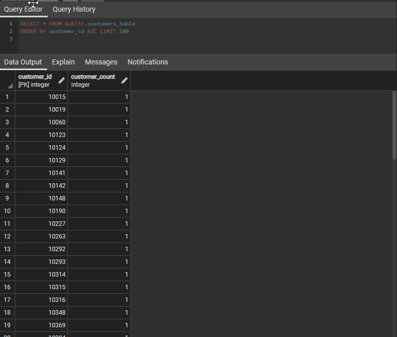
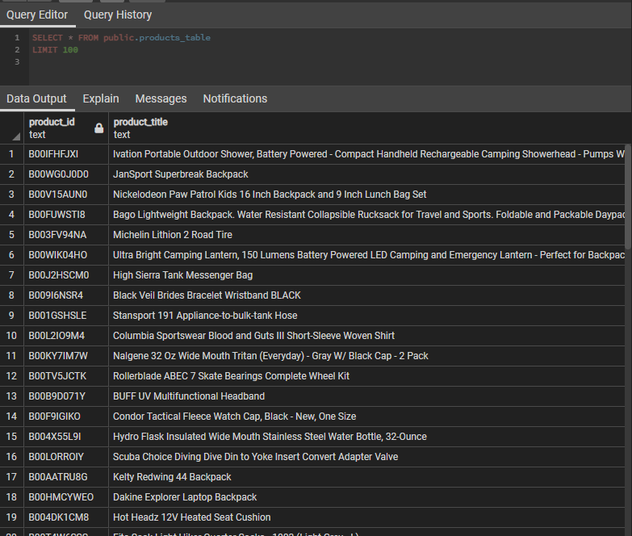
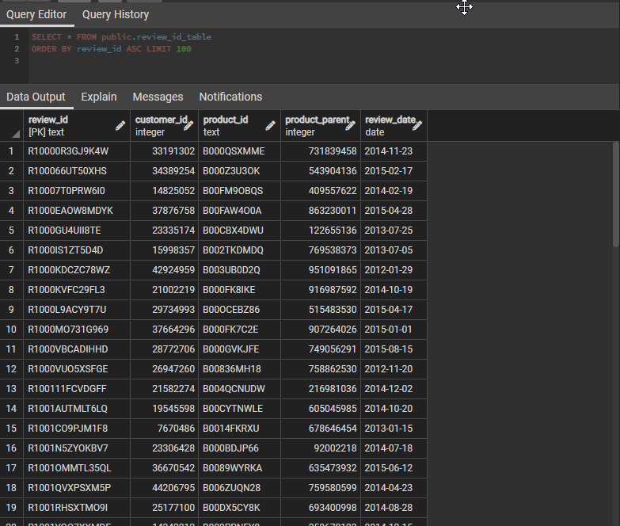
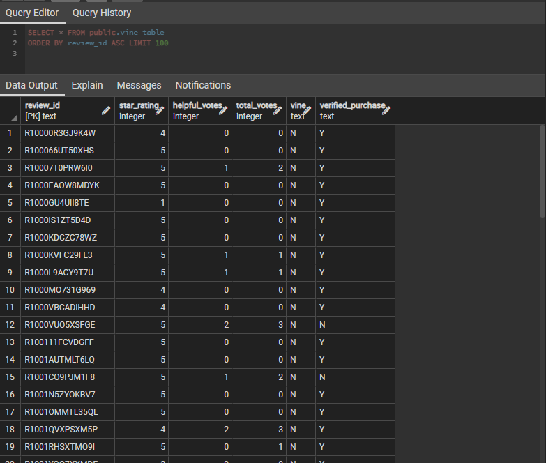
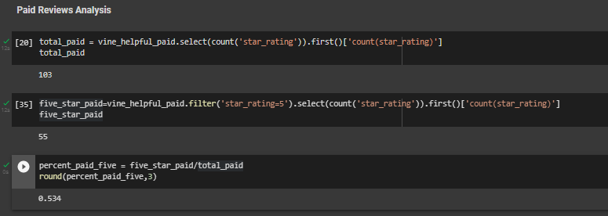
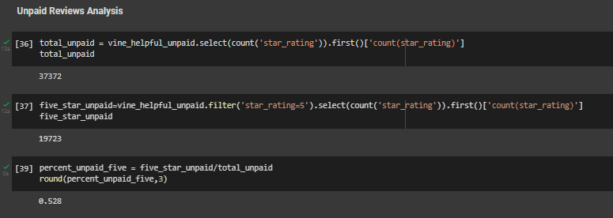

# **Amazon Vine Analysis**

## **Objective**
The purpose of this analysis is to see the impact of paid reviews of real Amazon products via the Amazon Vine program. Understanding if these paid reviews are more or less positive compared to organic reviews will help the business understand their impact on product reviews as a whole.

## **Results**
### **Deliverable 1**

### **Deliverable 2**
**The full results for the paid reviews (Vine Program) are the below:**

**The full results for the unpaid reviews (non-Vine Program) are the below:**

## **Summary**
The ratios of 5-star ratings for both the paid and non-paid reviews are so similar that it would suggest there is not positivity bias from the paid reviews.

As for future analysis, going a layer deper and understanding whether certain products over or under index on 5-star reviews could showcase where some items are benefitting undeservedly from paid reviews.